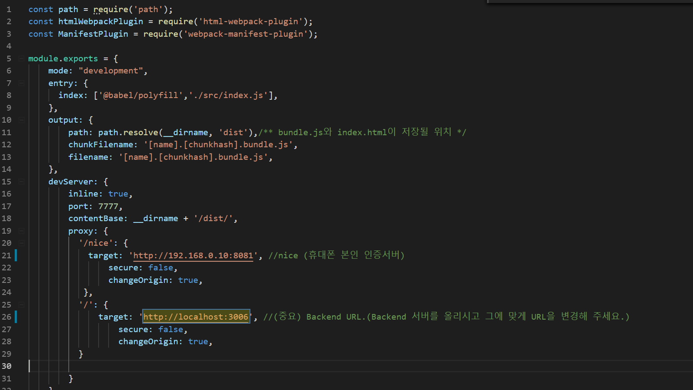

# 프로젝트 시작하기 :sparkles:

## 작업환경 설정
- Nodejs LTS 버전 설치
- npm 설치
- 에디터 설치(VScode, Atom 등 그외에도 원하는 에디터)  
  - 개인적으로 Atom은 느려서 VScode 추천 드립니다. 그리고 VSCode경우 오류 찾기도 더 편하답니다^_^
- git설치

## 프로젝트 생성
(템플릿이 아닌 새로운 프로젝트를 만들어 사용하는 경우에만)
- `mkdir 프로젝트명`  
- `cd 프로젝트명`  
- `npm init`

## 프로젝트 실행하기
* cmd창 혹은 git bash 혹은 에디터의 터미널 창을 열고 원하는 폴더 위치로 이동합니다.  
* 해당 폴더 위치에서 템플릿 프로젝트 GitHub에서 소스를 clone하여 다운 받습니다.  
  `git clone https://github.com/hitechinfo/template_frontend_react_001.git`
  * Tip) Git bash를 사용하셔도 좋지만 sourcetree 등과 같은 Git Client Tool을 사용하시면 소스를 관리하기 편리합니다.   
* 해당 위치에서 `npm install` 명령어를 실행합니다. 
  * `npm install`이란? package.json라는 파일에 정의한 패키지를 설치하는 명령어 입니다. 설치된 모듈은 node_modules 폴더에서 확인가능합니다.  
* `npm start` 명령어를 실행하고 http://localhost:7777 에 화면이 뜨면 성공!  

## Backend와 연결하기
이제 Front-end와 Back-end를 연결해 봅시다. 
### Backend 서버 올리기
Backend 템플릿 가이드에 따라서 MariaDB를 설치 및 실행하고 로컬에 Backend 서버를 올립니다.
```
(Backend 서버 올린 뒤 Message 예시)
Example app listening on port : 3005
Database sync
```
위와 같이 Backend가 올라오면 성공! 위의 Bakend Port `3005`를 기억하세요!

### Backend와 Frontend연결
Frontend 소스의 `webpakc.config.dev.js`를 엽니다.

위에서 올린 백엔드의 url과 port를 입력하고 서버를 다시 올리면 완료!

## github 관련
* :warning:**하나의 PC를 여러 사람이 사용하기 때문에 다른 모듈의 repository에 push 하지 않도록 github 계정, 소스 관리 등에 주의하시기 바랍니다**  
* 새로운 모듈이 추가된 package.json을 pull 받았을때는 `npm install` 명령어를 통해 추가된 모듈을 설치하고 `npm start`를 실행해야 합니다.  
* node_modules 폴더는 github에 푸시되지 않도록 합니다. (gitignore 파일에 설정)  
