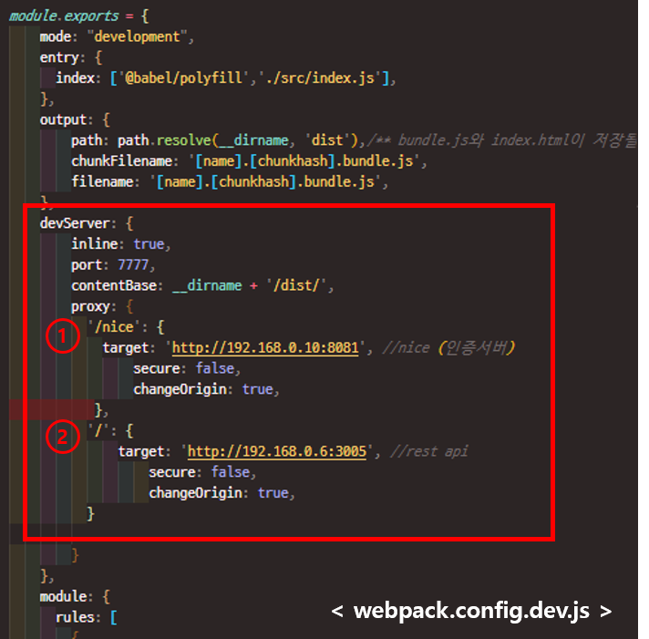
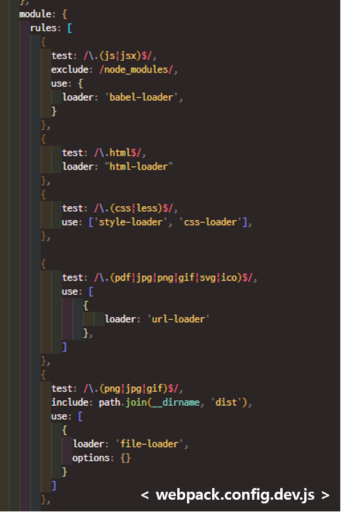

# 프로젝트 설정 :sparkles:


## Webpack 설정
webpack은 오픈 소스 자바스크립트 모듈 번들러(빌더) 입니다.  
프로젝트를 번들링(빌드) 하게 되면 프로젝트 내의 모든 파일(js, css, 이미지 등)들은 하나의 js파일로 빌드되며, 이를 화면 html에서 script 로드시켜서 사용하게 됩니다.  
개발 진행 시 개발 번들링 설정은 `webpack.config.dev.js` 파일을 설정합니다.  
운영에 배포 시 운영 배포 번들링 설정은 `webpack.config.js` 파일에 설정합니다.  
현재 webpack은 **webpack4**를 사용합니다.  
* [Proxy 설정](#Proxy-설정)  
* [Loader 설정](#Loader-설정)  
* [Bundle Chunking 설정](#Bundle-Chunking-설정)  

### Proxy 설정
---------------------------
사용 중 PC에서 다른 PC로 통신이 필요할 때 (Backend 통신, 인증 서버 통신 등) Proxy 설정이 필요합니다.


현재 프로젝트에는 두 가지 proxy 설정이 존재합니다.
①은 인증서버, ②는 Backend 서버에 대한 설정입니다.

②를 기준으로 설명을 하면,
- ‘/ ’ : 분기를 결정하는 prefix 입니다. 
         Rest call url이 ‘/’ 로 시작하는 경우 해당 target
         으로 요청을 보냅니다.
- target : 요청을 보낼 서버의 IP와 port정보입니다.

위와 같은 형태로 url별로 다른 서버를 호출할 수 있습니다

Rest call 시 에러가 발생한다면 target IP와 port를 확인하시기 바랍니다. 리부팅 등의 이유로 종종 ip가 바뀔 때가 있습니다.

### Loader 설정
---------------------------
Webpack은 자바스크립트를 해석하여 동작합니다. JS가 아닌 폰트, 이미지, css 등의 파일들은 webpack이 빌드할 때 적용될 파일로 인식할 수 있도록 설정해주어야 합니다. 이 설정은 webpack.config.js의 module에 loader를 설치 및 추가하여 설정합니다.  
  
각각의 loader는 `npm install` 명령어를 통해 설치 할 수 있으며, 기본적으로 test에 로딩할 파일 확장자를 정규표현식으로 지정하고 use에 사용할 loader를 설정합니다.

일반적으로 개발에 필요한 Loader의 경우 이미 설정되어 있으므로 이 외에 필요한 모듈이 있을 시 추가해서 사용하시면 됩니다.
(단, 모듈을 추가하실 경우 공유 부탁드립니다.) 

### Bundle(빌드) Chunking 설정
---------------------------
* 기존 번들링의 문제점  
소스파일을 하나의 파일(ex.bundle.js)로 번들링 할 때 여러 라이브러리 및 assets들을 사용하면 번들 파일이 무거워 질 수 있습니다. 이런 경우 네트워크 상황에 따라서 브라우저에서 js파일을 처음 로딩하는데 시간이 오래 걸릴 수 있다는 단점이 있습니다.

* 해결  
bundle을 쪼개서(splitting)하여 브라우저에서 로딩하는 시간을 줄일 수 있습니다.

* 방법1. multi entry point  
가장 간단한 방법으로 번들링 파일을 여러 개의 파일로 나누는 것입니다.  
아래와 같이 entry point(진입점)을 2개 이상으로 설정하여 번들링 파일의 사이즈를 줄일 수 있습니다. 
```js
    entry: {
      index: ['@babel/polyfill','./src/index.js'],
      module1: ['@babel/polyfill','./src/module1_index.js'],
    },
````

* 방법2. optimization.splitChunks 옵션 (프로젝트 세팅에서 사용한 방법)  
쪼개서 번들링하여 로딩 시간을 줄이는 방법입니다.  
```js
    optimization: {
      /** 번들 쪼개기 설정 */
      splitChunks: {
        /** 한 bundle당 최대 사이즈(byte단위) */
        // maxSize: 300000, //300kb, 약 292kib
        cacheGroups: {
          /** node_modules 폴더를 vendors.bundle.js로 만듬 */
          node_vendors: {
            test: /[\\/]node_modules[\\/]/,
            name: 'vendors',
            chunks: 'all'
          },
          /** public 폴더를 images.bundle.js로 만듬 */
          public_images: {
            test: /[\\/]public[\\/]/,
            name: 'images',
            chunks: 'all'
          }
        }
      }
    },
```
