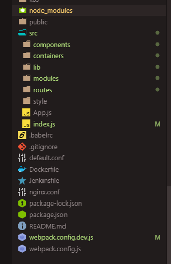

개발:computer::smiling_imp::computer:
---------------------------

여러 프로젝트가 개발을 진행하므로, 개발 진행 시 tip이나 코드 규약 등을 정해서 사용합니다.

[프로젝트 구조](#프로젝트-구조)  
[주요 사용 모듈](#주요-사용-모듈)  
[개발 시 유의점](#개발-시-유의점)  

### 프로젝트 구조
---------------------------


**개발관련**  
* `node_modules` : npm install 시 설치되는 module이 저장되는 폴더  
* `public` : react app의 가장 root가 되는 element가 위치하는 index.html이 위치하는 폴더  
* `src` : application 관련 코드가 위치  
* `components` : 컴포넌트 형태의 component가 위치 (컴포넌트 형태는 주로 redux연결 없이 단순 view를 목적으로 하는 경우가 많다. presentational components라고도 함)  
* `containers` : 컨테이너 형태의 component가 위치 (components 폴더에 선언한 여러 컴포넌트들을 조합해서 완성된 형태를 보여주는 것을 컨테이너라고 한다. props관리를 위해 redux가 connect되는 레벨)  
* `lib` : 프로젝트 자체적으로 필요한 user-custom module이 위치하는 폴더 (날짜 formatter, session storage control 등)  
* `modules` : state상태 관리를 위한 reducer가 위치하는 폴더 (reducer + action 형태로 선언/관리 된다)  
* `routes` : url 이동정보 (인증 필요/불필요로 구분)  
* `style` : css파일이 위치한 폴더  
* `App.js` : application의 시작점 js  
* `index.js` : react의 root dom이 그려지는 js. 화면의 전체구조를 정의    
* `package.json` : 현재 프로젝트의 정보 파일  
* `webpack.config.dev.js` : 개발 진행 시 프로젝트 설정파일  
* `webpack.config.js` : 운영 배포 시 프로젝트 설정파일  
  
**설정관련**  
* `babelrc` : 바벨 설정파일
* `gitignore` : github commit시 제외할 항목을 설정하는 파일  
* `Dockerfile` : docker 설정파일  
* `Jenkinsfile` : Jenkins 설정파일  
* `nginx.conf` : nginx 설정파일   

<br/>
<br/>

### 주요 사용 모듈
---------------------------

Front end 개발 시 주로 사용하는 모듈은 아래와 같으며, 추가적인 모듈이 필요한 경우 npm install 을 통해 설치하고 import하여 사용할 수 있습니다.
<br/>

* `react` : react view를 만들기 위한 라이브러리  
* `react-dom` : react를 브라우저에 rendering 할 때 사용되는 라이브러리  
* `redux` : redux 사용을 위한 라이브러리  
* `react-redux` : redux를 react컴포넌트에 연결하기 위해 사용되는 라이브러리  
* `react-router-dom` : 화면 이동을 위해 설정 및 사용하는 라이브러리  
* `redux-actions` : action 생성을 편리하도록 해주는 라이브러리  
* `immutable` : object의 생성 및 변경을 편리하게 할 수 있게 하는 라이브러리 (항상 new object를 return)  
* `lodash` : object의 형태 변형을 편리하게 할 수 있게 하는 라이브러리  
* `axios` : Rest 비동기 호출을 위해 사용하는 모듈  
<br/>
:triangular_flag_on_post: UI framework는 각 모듈별 자체적으로 선정해서 사용  

<br/>
<br/>

### 개발 시 유의점
---------------------------

**Axios** 

* GET, POST, PUT, DELETE 사용시 parameter 전달은 각각의 옵션에 맞게 전달합니다   
(ex POST 사용하는데 url에 parameter 전달 X)
* Headers에 `Pragma : 'no-cache'` 명령어는 ie 에서 오류를 방지하는 것 이므로 항상 포함시키도록 해야합니다
* 기본형태는 `then / catch` 형태로 사용. Finally는 꼭 필요 시에만 사용합니다

<br/>

**Token**  

토큰(인증)이 필요한 모든 rest 통신(axios)에 기존 토큰을 전달하고 새 토큰을 받아와야 합니다  
만약 토큰 만료시간(2시간)이 지나거나 정상적인 접속이 아닐 때는 로그아웃 시키고 로그인 화면으로 redirect 시킵니다  
<br/>

* 토큰 전달 시 axios headers에 `x-access-token` 필드에 기존 토큰 전달합니다
* Backend에서로부터 새로운 토큰 받았을 때는 return data의 headers에서 꺼내어 사용합니다
* 보안이 보장되어야 하는 정보 (유저 정보, 토큰) 들은 headers에 넣어서 backend로 전달합니다


```
axios({
    url: `/faq`,
    method : 'post',
    data: {
      faqCategory: faqCategory,
      faqQuestion: faqQuestion,
      faqAnswer: faqAnswer
    },
    headers: { "Pragma": 'no-cache',
                "x-access-token": storage.getToken() }  //session storage에서 저장된 token을 빼와서 token을 전달.
}).then(
      (res)=>{
          if(res.data){
              alert("저장이 완료되었습니다");

              //backend에서 받아온 새로운 token 정보를 다시 브라우져에 저장
              storage.setSessionObj(res.headers);
              //팝업닫기 
              this.setState({
                openPopupCreate:false,
                faqObj: {
                    faqCategory:"",
                    faqSeq:"",
                    faqQuestion:"",
                    faqAnswer:""
                },
                selectedQuestion : -1
              });
              //다시 리스트 호출
              this.handleGetFaqList();
          }
      }
).catch(
      (err)=>{
          if(err) console.log("err", err.response)
      }
);

```
<br/>

**Route**  

* 로그인(토큰)이 필요한 화면과 그렇지 않은 화면을 각각 다르게 분리시킵니다(1)  
* 로그인이 필요한 화면인데 하지 않았을 경우 로그인 화면으로 redirect 시킵니다(2,3) (아래 예시 참조. 따로 수정필요 X)

1. src/routes/index.js
```
// 로그인이 필요한 서비스 url
export const privateRoutes = [
  { /**faq 페이지 */
    path: "/faq",
    component: FaqContainer
  },

];

// 로그인이 필요없는 서비스 url
export const publicRoutes = [

  {/** 소개페이지1  */
    path: "/intro/main",
    component: IntroContainer
  },
  {/** 소개페이지2 */
    path: "/intro/programs",
    component: IntroContainer
  }

];
```

2. 로그인이 필요한 경우는 아래의 함수를 탄다. src/containers/common/AuthRoute.js (따로 수정할 필요 X)
```
const AuthRoute = ({ component: Component, ...rest }) => (
  
  <Route
    {...rest}
    render={props =>
      storage.isLogin() ? (
        <Component {...props} />
      ) : (
        <Redirect
          to={{
            pathname: "/login",
            state: { from: props.location }
          }}
        />
      )
    }
  />
);

export default AuthRoute
```

3. 로그인이 필요없는 경우는 아래의 함수를 탄다. src/containers/common/UnauthRoute.js (수정할 필요 X)
```

const UnauthRoute = ({ component: Component, ...rest }) => (
  <Route
    {...rest}
    render={props =>
      !auth.isLogin() ? (
        <Component {...props} />
      ) : (
        <Redirect
          to={{
            pathname: "/",
            state: { from: props.location }
          }}
        />
      )
    }
  />
);

export default UnauthRoute;
```
<br/>

**select option 조회시**  

* select option을 DB에서 조회할때는 url을 `'/commonCode/그룹명/첫번째값'` 형태로 사용합니다.  
* select option 조회 url중 그룹명, 첫번째값은 대문자형태로 사용합니다.    
* 아래 예시는 질문 카테고리 option을 가져올때 첫번째값을 '선택'으로 가져오도록 backend에서 정의된 조회 api를 call한 모습입니다.  

```
//팝업용 카테고리 코드
axios({
    url: `/commonCode/QUESTION/S`,//코드 URL은 뒤에 주소 대문자 사용함 (첫번째값 S: '선택', A: '전체')
    method : 'get',
    headers: { Pragma: 'no-cache'}
}).then(
    (res)=>{
        if(res.data){
            code["qnaCategoryCodePopup"] = res.data;
            this.setState({
                code
            })
        }
    }
).catch(
    (err)=>{ if(err) console.log("코드 get err", err.response); }
)
```
